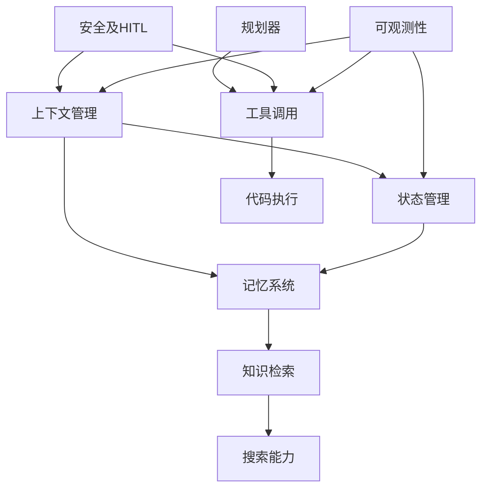

# OpenCopilot 智能体核心模块设计文档

> **文档状态**: v1.0  
> **更新日期**: 2026-06-01  
> **设计原则**: 100% API 覆盖 | 乐高积木式可插拔 | 独立组合  
> **整合来源**: Agent_OS_Research_Report.md | OpenCopilot_Development_TODO.md | Coding_Agent_Design.md | Smart_Copilot_API_Redesign.md

---

## 摘要

本文档将 OpenCopilot 的智能体架构整合为 **10 个核心模块**，每个模块都是独立的"乐高积木"，可以：
- **独立运行**：单独使用某个模块
- **自由组合**：按需组合多个模块
- **API 驱动**：每个模块 100% 通过 API 暴露能力
- **可插拔替换**：模块内部实现可替换，接口不变

---

## 一、整体架构

### 1.1 模块全景图

```
┌─────────────────────────────────────────────────────────────────────────────┐
│                          OpenCopilot Agent Core                             │
├─────────────────────────────────────────────────────────────────────────────┤
│                                                                             │
│  ┌─────────────┐  ┌─────────────┐  ┌─────────────┐  ┌─────────────┐        │
│  │  上下文管理  │  │  状态管理    │  │  记忆系统    │  │  知识检索    │        │
│  │  (Context)   │  │  (State)     │  │  (Memory)    │  │  (Knowledge) │        │
│  └──────┬──────┘  └──────┬──────┘  └──────┬──────┘  └──────┬──────┘        │
│         │                │                │                │                │
│         └────────────────┴────────────────┴────────────────┘                │
│                                    │                                        │
│                                    ▼                                        │
│  ┌─────────────┐  ┌─────────────┐  ┌─────────────┐  ┌─────────────┐        │
│  │  搜索能力    │  │  规划器      │  │  工具调用    │  │  代码执行    │        │
│  │  (Search)    │  │  (Planner)   │  │  (Tool)      │  │  (Executor)  │        │
│  └──────┬──────┘  └──────┬──────┘  └──────┬──────┘  └──────┬──────┘        │
│         │                │                │                │                │
│         └────────────────┴────────────────┴────────────────┘                │
│                                    │                                        │
│                                    ▼                                        │
│         ┌─────────────────────────────────────────────────┐                 │
│         │           安全及 HITL (Security & HITL)          │                 │
│         └─────────────────────────────────────────────────┘                 │
│                                    │                                        │
│                                    ▼                                        │
│         ┌─────────────────────────────────────────────────┐                 │
│         │             可观测性 (Observability)              │                 │
│         └─────────────────────────────────────────────────┘                 │
│                                                                             │
└─────────────────────────────────────────────────────────────────────────────┘
```

### 1.2 设计原则

| 原则 | 说明 | 实现方式 |
|------|------|----------|
| **100% API 覆盖** | 每个能力都有对应的 API 端点 | RESTful + WebSocket |
| **乐高积木式** | 模块可独立使用 | 依赖注入 + 接口抽象 |
| **可插拔替换** | 内部实现可替换 | 策略模式 + 工厂模式 |
| **独立组合** | 模块间松耦合 | 事件总线 + 消息队列 |

### 1.3 模块依赖关系



---

## 二、模块详细设计

### 2.1 上下文管理模块 (Context Manager)

**职责**：管理智能体的上下文信息，包括会话上下文、环境上下文、任务上下文。

#### 2.1.1 核心组件

```python
class ContextManager:
    """上下文管理器 - 乐高积木模块"""
    
    def __init__(self, config: ContextConfig = None):
        self.config = config or ContextConfig()
        self.providers: Dict[str, ContextProvider] = {}
        self.window_manager = ContextWindowManager()
        self.envelope_builder = ContextEnvelopeBuilder()
    
    # ========== API 接口 ==========
    
    async def get_current_context(self, source: str = None) -> ContextEnvelope:
        """获取当前上下文"""
        pass
    
    async def inject_context(self, context: ContextEnvelope) -> None:
        """注入上下文"""
        pass
    
    async def get_context_history(self, limit: int = 10) -> List[ContextEnvelope]:
        """获取上下文历史"""
        pass
    
    async def build_messages(self, system_prompt: str, 
                            envelope: ContextEnvelope,
                            history: List[Message]) -> List[Message]:
        """构建消息列表（预算驱动）"""
        pass
```

#### 2.1.2 API 端点

| 方法 | 端点 | 说明 |
|------|------|------|
| `GET` | `/api/context/current` | 获取当前上下文 |
| `POST` | `/api/context/inject` | 注入上下文 |
| `GET` | `/api/context/history` | 获取上下文历史 |
| `POST` | `/api/context/build-messages` | 构建消息列表 |
| `GET` | `/api/context/sources` | 获取可用上下文源 |
| `POST` | `/api/context/subscribe` | 订阅上下文变更 |

#### 2.1.3 上下文来源适配器

```python
class ContextProvider(ABC):
    """上下文提供者接口"""
    
    @abstractmethod
    async def get_context(self) -> ContextEnvelope:
        pass
    
    @abstractmethod
    def get_source_type(self) -> str:
        pass

# 已实现的提供者
class IDEContextProvider(ContextProvider):
    """IDE 上下文提供者"""
    pass

class BrowserContextProvider(ContextProvider):
    """浏览器上下文提供者"""
    pass

class ClipboardContextProvider(ContextProvider):
    """剪贴板上下文提供者"""
    pass

class FileContextProvider(ContextProvider):
    """文件上下文提供者"""
    pass
```

#### 2.1.4 上下文信封 (ContextEnvelope)

```python
class ContextEnvelope:
    """上下文信封 - 统一上下文格式"""
    
    source: str           # 来源: ide|browser|clipboard|file|custom
    content: str          # 主要内容
    selection: str        # 选中文本
    task: str             # 关联任务
    metadata: Dict        # 元信息
    timestamp: float      # 时间戳
    
    # 元信息示例
    # {
    #     "file_name": "main.py",
    #     "language": "python",
    #     "app_name": "VSCode",
    #     "url": "https://...",
    #     "diagnostics": [...],
    #     "git_diff": "..."
    # }
```

---

### 2.2 状态管理模块 (State Manager)

**职责**：管理智能体的任务状态、执行状态、会话状态。

#### 2.2.1 核心组件

```python
class StateManager:
    """状态管理器 - 乐高积木模块"""
    
    def __init__(self, db_path: str = "agent_state.db"):
        self.db_path = db_path
        self.task_registry: Dict[str, TaskStateMachine] = {}
        self.session_store = SessionStore(db_path)
        self.checkpoint_manager = CheckpointManager(db_path)
    
    # ========== API 接口 ==========
    
    async def create_task(self, task_def: TaskDefinition) -> Task:
        """创建任务"""
        pass
    
    async def get_task(self, task_id: str) -> Task:
        """获取任务状态"""
        pass
    
    async def update_task_status(self, task_id: str, 
                                 status: TaskStatus) -> None:
        """更新任务状态"""
        pass
    
    async def save_checkpoint(self, task_id: str, 
                              checkpoint: Checkpoint) -> None:
        """保存检查点"""
        pass
    
    async def resume_from_checkpoint(self, task_id: str) -> Task:
        """从检查点恢复"""
        pass
    
    async def get_task_history(self, session_id: str) -> List[Task]:
        """获取任务历史"""
        pass
```

#### 2.2.2 API 端点

| 方法 | 端点 | 说明 |
|------|------|------|
| `POST` | `/api/state/tasks` | 创建任务 |
| `GET` | `/api/state/tasks/{task_id}` | 获取任务状态 |
| `PUT` | `/api/state/tasks/{task_id}/status` | 更新任务状态 |
| `POST` | `/api/state/tasks/{task_id}/checkpoint` | 保存检查点 |
| `POST` | `/api/state/tasks/{task_id}/resume` | 从检查点恢复 |
| `GET` | `/api/state/tasks/{task_id}/steps` | 获取任务步骤 |
| `GET` | `/api/state/sessions/{session_id}` | 获取会话状态 |
| `POST` | `/api/state/sessions/{session_id}/clear` | 清除会话 |

#### 2.2.3 任务状态机

```python
class TaskStatus(Enum):
    PENDING = "pending"
    PLANNING = "planning"
    RUNNING = "running"
    PAUSED = "paused"
    COMPLETED = "completed"
    FAILED = "failed"
    CANCELLED = "cancelled"

class TaskStateMachine:
    """任务状态机"""
    
    TRANSITIONS = {
        TaskStatus.PENDING: [TaskStatus.PLANNING, TaskStatus.CANCELLED],
        TaskStatus.PLANNING: [TaskStatus.RUNNING, TaskStatus.CANCELLED],
        TaskStatus.RUNNING: [TaskStatus.PAUSED, TaskStatus.COMPLETED, 
                            TaskStatus.FAILED, TaskStatus.CANCELLED],
        TaskStatus.PAUSED: [TaskStatus.RUNNING, TaskStatus.CANCELLED],
        TaskStatus.COMPLETED: [],
        TaskStatus.FAILED: [TaskStatus.PENDING],  # 允许重试
        TaskStatus.CANCELLED: [],
    }
    
    def can_transition(self, from_status: TaskStatus, 
                       to_status: TaskStatus) -> bool:
        return to_status in self.TRANSITIONS.get(from_status, [])
```

#### 2.2.4 SQLite 存储结构

```sql
-- 任务表
CREATE TABLE IF NOT EXISTS tasks (
    task_id TEXT PRIMARY KEY,
    session_id TEXT,
    task_type TEXT,
    status TEXT DEFAULT 'pending',
    total_steps INTEGER DEFAULT 0,
    current_step INTEGER DEFAULT 0,
    plan JSON,
    result JSON,
    error TEXT,
    created_at REAL,
    updated_at REAL,
    metadata JSON
);

-- 任务步骤表
CREATE TABLE IF NOT EXISTS task_steps (
    step_id TEXT PRIMARY KEY,
    task_id TEXT,
    step_index INTEGER,
    step_name TEXT,
    step_type TEXT,
    status TEXT DEFAULT 'pending',
    input JSON,
    output JSON,
    error TEXT,
    started_at REAL,
    completed_at REAL,
    duration_ms REAL,
    FOREIGN KEY(task_id) REFERENCES tasks(task_id)
);

-- 检查点表
CREATE TABLE IF NOT EXISTS checkpoints (
    checkpoint_id TEXT PRIMARY KEY,
    task_id TEXT,
    step_id TEXT,
    state_snapshot JSON,
    created_at REAL,
    FOREIGN KEY(task_id) REFERENCES tasks(task_id)
);
```

---

### 2.3 记忆系统模块 (Memory System)

**职责**：管理短期记忆（会话历史）和长期记忆（持久化知识）。

#### 2.3.1 核心组件

```python
class MemorySystem:
    """记忆系统 - 乐高积木模块"""
    
    def __init__(self, db_path: str = "agent_memory.db"):
        self.short_term = ShortTermMemory()  # 内存
        self.long_term = LongTermMemory(db_path)  # SQLite
        self.episodic = EpisodicMemory()  # 情节记忆
        self.consolidator = MemoryConsolidator()  # 记忆整合器
    
    # ========== API 接口 ==========
    
    async def add_memory(self, memory: Memory) -> str:
        """添加记忆"""
        pass
    
    async def recall(self, query: str, 
                     memory_type: MemoryType = None) -> List[Memory]:
        """回忆记忆"""
        pass
    
    async def get_session_history(self, session_id: str, 
                                  limit: int = 10) -> List[Message]:
        """获取会话历史"""
        pass
    
    async def consolidate(self, session_id: str) -> None:
        """整合短期记忆到长期记忆"""
        pass
    
    async def forget(self, memory_id: str) -> None:
        """遗忘记忆"""
        pass
    
    async def search_memory(self, query: str, 
                           filters: Dict = None) -> List[Memory]:
        """搜索记忆"""
        pass
```

#### 2.3.2 API 端点

| 方法 | 端点 | 说明 |
|------|------|------|
| `POST` | `/api/memory/add` | 添加记忆 |
| `POST` | `/api/memory/recall` | 回忆记忆 |
| `GET` | `/api/memory/session/{session_id}` | 获取会话历史 |
| `POST` | `/api/memory/consolidate` | 整合记忆 |
| `DELETE` | `/api/memory/{memory_id}` | 遗忘记忆 |
| `POST` | `/api/memory/search` | 搜索记忆 |
| `GET` | `/api/memory/statistics` | 获取记忆统计 |
| `POST` | `/api/memory/export` | 导出记忆 |

#### 2.3.3 记忆类型

```python
class MemoryType(Enum):
    SHORT_TERM = "short_term"    # 短期记忆（会话内）
    LONG_TERM = "long_term"      # 长期记忆（持久化）
    EPISODIC = "episodic"        # 情节记忆（事件序列）
    SEMANTIC = "semantic"        # 语义记忆（知识）
    PROCEDURAL = "procedural"    # 程序记忆（技能）

class Memory:
    """记忆单元"""
    
    memory_id: str
    memory_type: MemoryType
    content: str
    embedding: List[float]  # 向量
    metadata: Dict
    importance: float  # 重要性评分 0-1
    access_count: int  # 访问次数
    created_at: float
    last_accessed: float
    ttl: Optional[float]  # 生存时间
```

#### 2.3.4 记忆整合策略

```python
class MemoryConsolidator:
    """记忆整合器 - 将短期记忆转为长期记忆"""
    
    async def consolidate(self, session_id: str) -> ConsolidationResult:
        """
        整合策略：
        1. 提取关键信息
        2. 去重合并
        3. 计算重要性
        4. 生成摘要
        5. 存储到长期记忆
        """
        pass
    
    def calculate_importance(self, memory: Memory) -> float:
        """
        重要性计算因素：
        - 用户明确要求记住
        - 包含决策或结论
        - 被多次引用
        - 包含错误或修正
        - 包含偏好设置
        """
        pass
```

---

### 2.4 知识检索模块 (Knowledge Retrieval)

**职责**：管理知识图谱，提供结构化知识检索能力。

#### 2.4.1 核心组件

```python
class KnowledgeRetrieval:
    """知识检索模块 - 乐高积木模块"""
    
    def __init__(self, db_path: str = "knowledge.db"):
        self.graph = KnowledgeGraph(db_path)
        self.indexer = KnowledgeIndexer()
        self.retriever = KnowledgeRetriever()
    
    # ========== API 接口 ==========
    
    async def query(self, query: str, 
                    entity_type: str = None) -> KnowledgeResult:
        """查询知识"""
        pass
    
    async def build(self, content: str, 
                    source: str = "api") -> BuildResult:
        """构建知识"""
        pass
    
    async def search_entity(self, keyword: str, 
                           entity_type: str = None) -> List[Entity]:
        """搜索实体"""
        pass
    
    async def find_related(self, entity_name: str, 
                          relation_type: str = None) -> List[Relation]:
        """查找关联"""
        pass
    
    async def find_path(self, source: str, 
                       target: str) -> List[Path]:
        """查找路径"""
        pass
    
    async def export(self, format: str = "json") -> bytes:
        """导出知识"""
        pass
    
    async def get_statistics(self) -> Dict:
        """获取统计信息"""
        pass
```

#### 2.4.2 API 端点

| 方法 | 端点 | 说明 |
|------|------|------|
| `POST` | `/api/knowledge/query` | 查询知识 |
| `POST` | `/api/knowledge/build` | 构建知识 |
| `POST` | `/api/knowledge/search-entity` | 搜索实体 |
| `POST` | `/api/knowledge/find-related` | 查找关联 |
| `POST` | `/api/knowledge/find-path` | 查找路径 |
| `POST` | `/api/knowledge/export` | 导出知识 |
| `GET` | `/api/knowledge/statistics` | 获取统计 |
| `DELETE` | `/api/knowledge/entities/{entity_id}` | 删除实体 |

#### 2.4.3 知识图谱结构

```python
class Entity:
    """知识实体"""
    
    entity_id: str
    name: str
    entity_type: str  # file|function|class|concept|person|...
    properties: Dict
    embeddings: List[float]
    created_at: float
    updated_at: float

class Relation:
    """知识关系"""
    
    relation_id: str
    source_id: str
    target_id: str
    relation_type: str  # uses|defines|imports|related_to|...
    properties: Dict
    weight: float

class KnowledgeGraph:
    """知识图谱"""
    
    def __init__(self, db_path: str):
        self.entities: Dict[str, Entity] = {}
        self.relations: Dict[str, Relation] = {}
        self.adjacency: Dict[str, List[str]] = {}  # 邻接表
```

---

### 2.5 搜索能力模块 (Search Capability)

**职责**：提供代码搜索、文档搜索、知识搜索等能力。

#### 2.5.1 核心组件

```python
class SearchCapability:
    """搜索能力模块 - 乐高积木模块"""
    
    def __init__(self):
        self.code_searcher = CodeSearcher()
        self.doc_searcher = DocumentSearcher()
        self.knowledge_searcher = KnowledgeSearcher()
        self.web_searcher = WebSearcher()
    
    # ========== API 接口 ==========
    
    async def search_code(self, query: str, 
                         filters: CodeFilters = None) -> List[SearchResult]:
        """搜索代码"""
        pass
    
    async def search_documents(self, query: str, 
                              filters: DocFilters = None) -> List[SearchResult]:
        """搜索文档"""
        pass
    
    async def search_knowledge(self, query: str, 
                               filters: KnowledgeFilters = None) -> List[SearchResult]:
        """搜索知识库"""
        pass
    
    async def search_web(self, query: str, 
                        max_results: int = 10) -> List[WebResult]:
        """搜索网络"""
        pass
    
    async def unified_search(self, query: str, 
                            sources: List[str] = None) -> List[SearchResult]:
        """统一搜索"""
        pass
```

#### 2.5.2 API 端点

| 方法 | 端点 | 说明 |
|------|------|------|
| `POST` | `/api/search/code` | 搜索代码 |
| `POST` | `/api/search/documents` | 搜索文档 |
| `POST` | `/api/search/knowledge` | 搜索知识库 |
| `POST` | `/api/search/web` | 搜索网络 |
| `POST` | `/api/search/unified` | 统一搜索 |
| `GET` | `/api/search/sources` | 获取可用搜索源 |
| `POST` | `/api/search/index` | 索引内容 |

#### 2.5.3 搜索结果格式

```python
class SearchResult:
    """搜索结果"""
    
    result_id: str
    source: str  # code|document|knowledge|web
    title: str
    content: str
    snippet: str
    relevance_score: float
    metadata: Dict
    url: Optional[str]
    line_number: Optional[int]
```

---

### 2.6 规划器模块 (Planner)

**职责**：将复杂任务分解为可执行步骤，生成执行计划。

#### 2.6.1 核心组件

```python
class Planner:
    """规划器模块 - 乐高积木模块"""
    
    def __init__(self, llm_provider=None):
        self.llm = llm_provider
        self.plan_generator = PlanGenerator()
        self.plan_validator = PlanValidator()
        self.plan_optimizer = PlanOptimizer()
    
    # ========== API 接口 ==========
    
    async def create_plan(self, task: str, 
                         context: Dict = None) -> Plan:
        """创建执行计划"""
        pass
    
    async def decompose_task(self, task: str) -> List[TaskStep]:
        """分解任务"""
        pass
    
    async def validate_plan(self, plan: Plan) -> ValidationResult:
        """验证计划"""
        pass
    
    async def optimize_plan(self, plan: Plan) -> Plan:
        """优化计划"""
        pass
    
    async def estimate_duration(self, plan: Plan) -> DurationEstimate:
        """估算执行时间"""
        pass
    
    async def replan(self, task_id: str, 
                     feedback: str = None) -> Plan:
        """重新规划"""
        pass
```

#### 2.6.2 API 端点

| 方法 | 端点 | 说明 |
|------|------|------|
| `POST` | `/api/planner/create` | 创建执行计划 |
| `POST` | `/api/planner/decompose` | 分解任务 |
| `POST` | `/api/planner/validate` | 验证计划 |
| `POST` | `/api/planner/optimize` | 优化计划 |
| `POST` | `/api/planner/estimate` | 估算执行时间 |
| `POST` | `/api/planner/replan` | 重新规划 |
| `GET` | `/api/planner/plans/{plan_id}` | 获取计划详情 |

#### 2.6.3 计划结构

```python
class Plan:
    """执行计划"""
    
    plan_id: str
    task: str
    steps: List[TaskStep]
    dependencies: Dict[str, List[str]]  # step_id -> [dependent_step_ids]
    estimated_duration: float
    confidence: float
    metadata: Dict

class TaskStep:
    """任务步骤"""
    
    step_id: str
    step_name: str
    step_type: str  # llm_call|tool_call|code_execution|human_approval
    description: str
    input_schema: Dict
    output_schema: Dict
    dependencies: List[str]  # 依赖的步骤ID
    timeout: float
    retry_count: int
    is_critical: bool
```

#### 2.6.4 任务分解策略

```python
class TaskDecomposer:
    """任务分解器"""
    
    DECOMPOSITION_PROMPT = """
    将以下任务分解为可执行的步骤：
    
    任务：{task}
    上下文：{context}
    
    要求：
    1. 每个步骤应该是原子操作
    2. 明确步骤间的依赖关系
    3. 标记需要人工确认的步骤
    4. 估算每个步骤的执行时间
    
    返回 JSON 格式的步骤列表。
    """
    
    async def decompose(self, task: str, 
                       context: Dict = None) -> List[TaskStep]:
        pass
```

---

### 2.7 工具调用模块 (Tool System)

**职责**：管理工具注册、发现、调用和结果处理。

#### 2.7.1 核心组件

```python
class ToolSystem:
    """工具调用模块 - 乐高积木模块"""
    
    def __init__(self):
        self.registry = ToolRegistry()
        self.executor = ToolExecutor()
        self.result_processor = ToolResultProcessor()
    
    # ========== API 接口 ==========
    
    async def register_tool(self, tool: Tool) -> str:
        """注册工具"""
        pass
    
    async def discover_tools(self, 
                            capability: str = None) -> List[Tool]:
        """发现工具"""
        pass
    
    async def call_tool(self, tool_name: str, 
                       params: Dict) -> ToolResult:
        """调用工具"""
        pass
    
    async def batch_call(self, calls: List[ToolCall]) -> List[ToolResult]:
        """批量调用"""
        pass
    
    async def get_tool_info(self, tool_name: str) -> Tool:
        """获取工具信息"""
        pass
    
    async def list_tools(self, category: str = None) -> List[Tool]:
        """列出工具"""
        pass
```

#### 2.7.2 API 端点

| 方法 | 端点 | 说明 |
|------|------|------|
| `POST` | `/api/tools/register` | 注册工具 |
| `GET` | `/api/tools/discover` | 发现工具 |
| `POST` | `/api/tools/call` | 调用工具 |
| `POST` | `/api/tools/batch-call` | 批量调用 |
| `GET` | `/api/tools/{tool_name}` | 获取工具信息 |
| `GET` | `/api/tools` | 列出工具 |
| `DELETE` | `/api/tools/{tool_name}` | 删除工具 |

#### 2.7.3 工具定义

```python
class Tool:
    """工具定义"""
    
    tool_id: str
    name: str
    description: str
    category: str  # file|code|web|system|custom
    input_schema: Dict  # JSON Schema
    output_schema: Dict  # JSON Schema
    parameters: Dict
    requires_approval: bool
    timeout: float
    retry_count: int

class ToolResult:
    """工具执行结果"""
    
    tool_call_id: str
    tool_name: str
    success: bool
    output: Any
    error: Optional[str]
    duration_ms: float
    metadata: Dict
```

#### 2.7.4 工具执行器

```python
class ToolExecutor:
    """工具执行器"""
    
    async def execute(self, tool: Tool, 
                     params: Dict) -> ToolResult:
        """执行工具"""
        # 1. 参数验证
        self._validate_params(tool, params)
        
        # 2. 权限检查
        if tool.requires_approval:
            await self._request_approval(tool, params)
        
        # 3. 执行工具
        start_time = time.time()
        try:
            result = await self._run_tool(tool, params)
            duration = (time.time() - start_time) * 1000
            return ToolResult(
                tool_call_id=str(uuid.uuid4()),
                tool_name=tool.name,
                success=True,
                output=result,
                duration_ms=duration
            )
        except Exception as e:
            return ToolResult(
                tool_call_id=str(uuid.uuid4()),
                tool_name=tool.name,
                success=False,
                error=str(e),
                duration_ms=(time.time() - start_time) * 1000
            )
```

---

### 2.8 代码执行引擎模块 (Code Executor)

**职责**：安全地执行代码，支持多种语言和沙盒环境。

#### 2.8.1 核心组件

```python
class CodeExecutor:
    """代码执行引擎 - 乐高积木模块"""
    
    def __init__(self, config: ExecutorConfig = None):
        self.config = config or ExecutorConfig()
        self.sandbox = SandboxManager()
        self.language_handlers: Dict[str, LanguageHandler] = {}
    
    # ========== API 接口 ==========
    
    async def execute_code(self, code: str, 
                          language: str,
                          timeout: float = 30) -> ExecutionResult:
        """执行代码"""
        pass
    
    async def execute_in_sandbox(self, code: str, 
                                language: str,
                                sandbox_config: Dict = None) -> ExecutionResult:
        """在沙盒中执行代码"""
        pass
    
    async def validate_code(self, code: str, 
                           language: str) -> ValidationResult:
        """验证代码"""
        pass
    
    async def get_supported_languages(self) -> List[str]:
        """获取支持的语言"""
        pass
    
    async def install_package(self, package: str, 
                             language: str) -> bool:
        """安装包"""
        pass
```

#### 2.8.2 API 端点

| 方法 | 端点 | 说明 |
|------|------|------|
| `POST` | `/api/executor/execute` | 执行代码 |
| `POST` | `/api/executor/sandbox` | 沙盒执行 |
| `POST` | `/api/executor/validate` | 验证代码 |
| `GET` | `/api/executor/languages` | 获取支持语言 |
| `POST` | `/api/executor/install` | 安装包 |
| `GET` | `/api/executor/status` | 获取执行器状态 |

#### 2.8.3 执行结果

```python
class ExecutionResult:
    """执行结果"""
    
    execution_id: str
    success: bool
    stdout: str
    stderr: str
    exit_code: int
    duration_ms: float
    memory_usage: int
    artifacts: List[str]  # 生成的文件
    error: Optional[str]
```

#### 2.8.4 沙盒配置

```python
class SandboxConfig:
    """沙盒配置"""
    
    # 资源限制
    max_memory: str = "512MB"
    max_cpu: float = 1.0
    max_disk: str = "1GB"
    timeout: float = 30
    
    # 网络限制
    allow_network: bool = False
    allowed_hosts: List[str] = []
    
    # 文件系统限制
    read_only_paths: List[str] = ["/"]
    writable_paths: List[str] = ["/tmp"]
    
    # 环境变量
    env_vars: Dict[str, str] = {}
```

---

### 2.9 安全及 HITL 模块 (Security & HITL)

**职责**：权限管理、安全审计、人工审批流程。

#### 2.9.1 核心组件

```python
class SecurityModule:
    """安全及HITL模块 - 乐高积木模块"""
    
    def __init__(self):
        self.permission_manager = PermissionManager()
        self.audit_logger = AuditLogger()
        self.approval_engine = ApprovalEngine()
        self.rate_limiter = RateLimiter()
    
    # ========== API 接口 ==========
    
    async def check_permission(self, user_id: str, 
                               resource: str,
                               action: str) -> bool:
        """检查权限"""
        pass
    
    async def request_approval(self, request: ApprovalRequest) -> str:
        """请求审批"""
        pass
    
    async def approve(self, approval_id: str, 
                     approver_id: str) -> bool:
        """批准"""
        pass
    
    async def reject(self, approval_id: str, 
                    approver_id: str,
                    reason: str) -> bool:
        """拒绝"""
        pass
    
    async def get_audit_log(self, filters: Dict = None) -> List[AuditEntry]:
        """获取审计日志"""
        pass
    
    async def validate_input(self, input_data: Dict, 
                            schema: Dict) -> ValidationResult:
        """验证输入"""
        pass
```

#### 2.9.2 API 端点

| 方法 | 端点 | 说明 |
|------|------|------|
| `POST` | `/api/security/check-permission` | 检查权限 |
| `POST` | `/api/security/approval/request` | 请求审批 |
| `POST` | `/api/security/approval/{id}/approve` | 批准 |
| `POST` | `/api/security/approval/{id}/reject` | 拒绝 |
| `GET` | `/api/security/audit-log` | 获取审计日志 |
| `POST` | `/api/security/validate` | 验证输入 |
| `GET` | `/api/security/permissions` | 获取权限列表 |
| `POST` | `/api/security/rate-limit/check` | 检查速率限制 |

#### 2.9.3 权限模型

```python
class Permission:
    """权限定义"""
    
    permission_id: str
    resource: str  # tool|file|api|system
    action: str    # read|write|execute|delete
    conditions: Dict  # 条件限制
    
class ApprovalRequest:
    """审批请求"""
    
    request_id: str
    requester_id: str
    action: str
    resource: str
    parameters: Dict
    reason: str
    urgency: str  # low|medium|high|critical
    created_at: float
    expires_at: float
    
class AuditEntry:
    """审计条目"""
    
    entry_id: str
    timestamp: float
    user_id: str
    action: str
    resource: str
    parameters: Dict
    result: str
    ip_address: str
    user_agent: str
```

#### 2.9.4 HITL 流程

```python
class HumanInTheLoop:
    """人工介入流程"""
    
    async def should_ask_human(self, context: Dict) -> bool:
        """判断是否需要人工介入"""
        # 需要人工介入的场景：
        # 1. 高风险操作（删除文件、执行命令）
        # 2. 不确定的决策
        # 3. 需要专业判断
        # 4. 用户明确要求
        pass
    
    async def ask_human(self, question: str, 
                       options: List[str] = None) -> HumanResponse:
        """向人工提问"""
        pass
    
    async def wait_for_approval(self, 
                               request_id: str,
                               timeout: float = 300) -> bool:
        """等待审批"""
        pass
```

---

### 2.10 可观测性模块 (Observability)

**职责**：监控、日志、追踪、指标收集。

#### 2.10.1 核心组件

```python
class ObservabilityModule:
    """可观测性模块 - 乐高积木模块"""
    
    def __init__(self):
        self.logger = StructuredLogger()
        self.metrics = MetricsCollector()
        self.tracer = DistributedTracer()
        self.health_checker = HealthChecker()
    
    # ========== API 接口 ==========
    
    async def log(self, level: str, message: str, 
                 context: Dict = None) -> None:
        """记录日志"""
        pass
    
    async def record_metric(self, name: str, 
                           value: float,
                           tags: Dict = None) -> None:
        """记录指标"""
        pass
    
    async def start_trace(self, operation: str) -> str:
        """开始追踪"""
        pass
    
    async def end_trace(self, trace_id: str, 
                       status: str = "success") -> None:
        """结束追踪"""
        pass
    
    async def get_health_status(self) -> HealthStatus:
        """获取健康状态"""
        pass
    
    async def get_metrics(self, 
                         metric_name: str = None,
                         time_range: Tuple[float, float] = None) -> Dict:
        """获取指标"""
        pass
    
    async def get_logs(self, filters: Dict = None, 
                      limit: int = 100) -> List[LogEntry]:
        """获取日志"""
        pass
    
    async def get_traces(self, 
                        filters: Dict = None) -> List[Trace]:
        """获取追踪"""
        pass
```

#### 2.10.2 API 端点

| 方法 | 端点 | 说明 |
|------|------|------|
| `POST` | `/api/observability/log` | 记录日志 |
| `POST` | `/api/observability/metrics` | 记录指标 |
| `POST` | `/api/observability/trace/start` | 开始追踪 |
| `POST` | `/api/observability/trace/end` | 结束追踪 |
| `GET` | `/api/observability/health` | 健康状态 |
| `GET` | `/api/observability/metrics` | 获取指标 |
| `GET` | `/api/observability/logs` | 获取日志 |
| `GET` | `/api/observability/traces` | 获取追踪 |
| `GET` | `/api/observability/dashboard` | 仪表盘数据 |

#### 2.10.3 日志结构

```python
class LogEntry:
    """日志条目"""
    
    log_id: str
    timestamp: float
    level: str  # DEBUG|INFO|WARNING|ERROR|CRITICAL
    message: str
    module: str
    function: str
    line_number: int
    context: Dict
    trace_id: Optional[str]
    span_id: Optional[str]

class Metric:
    """指标"""
    
    name: str
    value: float
    timestamp: float
    tags: Dict
    unit: str

class Trace:
    """追踪"""
    
    trace_id: str
    spans: List[Span]
    start_time: float
    end_time: float
    duration_ms: float
    status: str

class Span:
    """跨度"""
    
    span_id: str
    parent_id: Optional[str]
    operation: str
    start_time: float
    end_time: float
    duration_ms: float
    tags: Dict
    status: str
```

#### 2.10.4 健康检查

```python
class HealthStatus:
    """健康状态"""
    
    status: str  # healthy|degraded|unhealthy
    version: str
    uptime: float
    modules: Dict[str, ModuleHealth]
    dependencies: Dict[str, DependencyHealth]
    performance: PerformanceMetrics

class ModuleHealth:
    """模块健康状态"""
    
    module_name: str
    status: str
    last_check: float
    error_count: int
    avg_response_ms: float
```

---

## 三、模块组合示例

### 3.1 简单对话场景

```python
# 只使用上下文管理 + 记忆系统
context_manager = ContextManager()
memory_system = MemorySystem()

# 构建对话
context = await context_manager.get_current_context("chat")
history = await memory_system.get_session_history(session_id)
messages = await context_manager.build_messages(system_prompt, context, history)
```

### 3.2 Bug 修复场景

```python
# 组合使用：上下文 + 知识检索 + 工具调用 + 代码执行
context_manager = ContextManager()
knowledge = KnowledgeRetrieval()
tool_system = ToolSystem()
executor = CodeExecutor()

# 1. 获取 IDE 上下文
context = await context_manager.get_current_context("ide")

# 2. 搜索相关知识
related = await knowledge.search_entity(context.metadata["file_name"])

# 3. 调用诊断工具
diagnostics = await tool_system.call_tool("get_diagnostics", {...})

# 4. 执行修复代码
result = await executor.execute_code(fix_code, "python")
```

### 3.3 复杂任务场景

```python
# 组合使用：规划器 + 状态管理 + 工具调用 + HITL + 可观测性
planner = Planner()
state_manager = StateManager()
tool_system = ToolSystem()
security = SecurityModule()
observability = ObservabilityModule()

# 1. 创建执行计划
plan = await planner.create_plan(task)

# 2. 创建任务
task = await state_manager.create_task(plan)

# 3. 执行步骤
for step in plan.steps:
    # 开始追踪
    trace_id = await observability.start_trace(step.step_name)
    
    # 检查是否需要审批
    if step.requires_approval:
        approved = await security.request_approval(step)
        if not approved:
            break
    
    # 执行步骤
    result = await tool_system.call_tool(step.tool, step.params)
    
    # 更新状态
    await state_manager.update_task_status(task.id, TaskStatus.RUNNING)
    
    # 结束追踪
    await observability.end_trace(trace_id)
```

---

## 四、实现路线图

### 4.1 阶段 1：基础框架（2-3 周）

- [ ] 上下文管理模块核心
- [ ] 状态管理模块核心
- [ ] 记忆系统模块核心
- [ ] 基础 API 框架

### 4.2 阶段 2：能力扩展（3-4 周）

- [ ] 知识检索模块
- [ ] 搜索能力模块
- [ ] 工具调用模块
- [ ] 代码执行引擎

### 4.3 阶段 3：高级特性（2-3 周）

- [ ] 规划器模块
- [ ] 安全及 HITL 模块
- [ ] 可观测性模块

### 4.4 阶段 4：集成优化（2-3 周）

- [ ] 模块间集成测试
- [ ] 性能优化
- [ ] 文档完善

---

## 五、与现有架构的映射

| 新模块 | 现有组件 | 迁移说明 |
|--------|----------|----------|
| 上下文管理 | `ContextWindowManager` | 扩展为独立模块 |
| 状态管理 | `SessionManager` | 扩展任务状态机 |
| 记忆系统 | `ASUAgentMemory` | 扩展为多层记忆 |
| 知识检索 | `KnowledgeSkill` | 直接复用 |
| 搜索能力 | `search_content` 等 | 封装为模块 |
| 规划器 | 无 | 新建 |
| 工具调用 | `SkillArchitecture` | 扩展为通用工具系统 |
| 代码执行 | 无 | 新建 |
| 安全及HITL | 部分在 Broker | 整合为独立模块 |
| 可观测性 | 无 | 新建 |

---

## 六、总结

本设计文档将 OpenCopilot 的智能体架构整合为 **10 个核心模块**，每个模块都遵循：

1. **100% API 覆盖**：所有能力通过 API 暴露
2. **乐高积木式**：可独立使用，可自由组合
3. **可插拔替换**：内部实现可替换，接口稳定
4. **独立组合**：模块间松耦合，通过事件总线通信

这种设计使得 OpenCopilot 能够：
- 快速迭代单个模块
- 灵活组合满足不同场景
- 易于测试和维护
- 支持渐进式迁移

---

## 七、实现状态

### 7.1 模块实现进度

| 模块 | 状态 | 实现文件 | 说明 |
|------|------|----------|------|
| **上下文管理** | ✅ 已完成 | `context_manager/` | 从 `asu_custom_agent.py` 抽取，保持向后兼容 |
| **状态管理** | ✅ 已完成 | `state_manager/` | 6个文件，含检查点/恢复/持久化 |
| **记忆系统** | ✅ 已完成 | `memory_system/` | 10个文件，含检索/遗忘/压缩/配额 |
| **知识检索** | ⚠️ 部分完成 | `knowledge_graph/` | 有知识图谱，未封装为独立模块 |
| **搜索能力** | ✅ 已完成 | `search_capability/` | 集成 MiniMax API，支持代码/文档/网络搜索 |
| **规划器** | ✅ 已完成 | `planner/` | 8个文件，含4种策略 |
| **工具调用** | ✅ 已完成 | `tool_system/` | 9个文件，含注册/执行/Skill适配 |
| **代码执行** | ✅ 已完成 | `code_executor/` | 5个文件+5个语言处理器 |
| **安全及HITL** | ✅ 已完成 | `security_module/` | 8个文件，含权限/审批/速率限制 |
| **可观测性** | ✅ 已完成 | `observability_module/` | 8个文件，含日志/指标/追踪/健康检查 |

### 7.2 最新更新 (2026-06-02)

#### 搜索能力模块

**实现文件**：
- `search_capability/__init__.py` - 模块入口
- `search_capability/core.py` - 核心接口
- `search_capability/minimax_search.py` - MiniMax 网络搜索
- `search_capability/code_search.py` - 代码搜索
- `search_capability/doc_search.py` - 文档搜索

**核心功能**：
```python
from search_capability import SearchCapability, SearchType

search = SearchCapability()

# 网络搜索（MiniMax API）
results = search.web_search("Python async await")

# 代码搜索
results = search.code_search("def process_data", scope="./src")

# 文档搜索
results = search.doc_search("架构设计", scope="./docs")

# 统一搜索
results = search.search("机器学习", search_type=SearchType.ALL)
```

**MiniMax 搜索 API**：
- 端点：`https://api.minimaxi.com/v1/coding_plan/search`
- 参数：`query`（必填），`count`（1-10）
- 需要 Token Plan API 密钥

#### 上下文管理模块

**实现文件**：
- `context_manager/__init__.py` - 模块入口
- `context_manager/core.py` - 核心接口
- `context_manager/context_envelope.py` - 上下文信封

**核心功能**：
```python
from context_manager import ContextManager, ContextWindowManager

# 初始化
manager = ContextManager(model_name="MiniMax-M3")

# 会话管理
manager.add_message("session_123", "user", "你好")
context = manager.get_context("session_123")

# 构建消息
messages = manager.build_messages(system_prompt, context, history)
```

**向后兼容**：
- 与 `asu_custom_agent.py` 中的 `ContextWindowManager` 100% 兼容
- 支持旧格式的上下文信封

### 7.3 测试验证

**测试文件**：`test_search_context_modules.py`

**测试结果**：
```
运行: 13, 失败: 0, 错误: 0
测试结果: 通过
```

**测试覆盖**：
- ✅ 搜索能力模块初始化
- ✅ 代码搜索功能
- ✅ 文档搜索功能
- ✅ MiniMax 搜索提供者
- ✅ 上下文管理器初始化
- ✅ 模型适配
- ✅ 消息构建
- ✅ 会话管理
- ✅ 向后兼容性

---

## 附录：相关文档

- `Agent_OS_Research_Report.md` - Agent OS 调研报告
- `OpenCopilot_Development_TODO.md` - 开发规划
- `Coding_Agent_Design.md` - Coding Agent 设计
- `Smart_Copilot_API_Redesign.md` - API 重新设计
- `smart_copilot_api.py` - 现有 API 实现
- `asu_custom_agent.py` - 现有 Agent 实现
- `search_capability/` - 搜索能力模块
- `context_manager/` - 上下文管理模块
